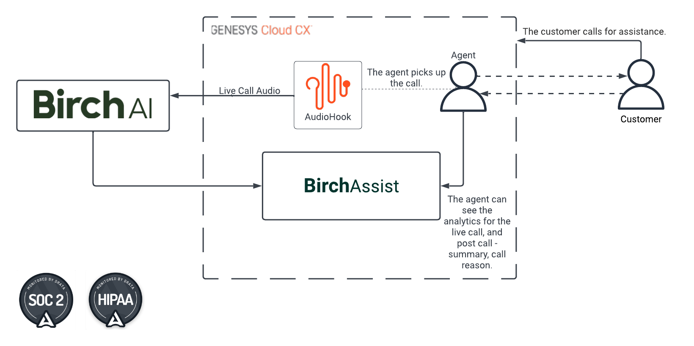

# Integrating Birch Assist

> View the [Birch Assist Blueprint](https://developer.mypurecloud.com/blueprints/genesys-birch-assist-blueprint/ "Goes to the Birch Assist Blueprint") in the Genesys Cloud Developer Center.

In this Genesys Cloud Developer Blueprint, Birch AI is used to automate complex after-call tasks. Our **Live Call Analytics** includes Task Tracking, Sentiment Tracking, Field Extraction, Pacing guidance, among others, as well as **After-Call Work** that includes summaries, reasons for the call, and classifications.

You can view the complete blueprint and download the sample files from [here](https://github.com/GenesysCloudBlueprints/genesys-birch-assist-blueprint "Genesys Cloud Birch Assist Blueprint").

